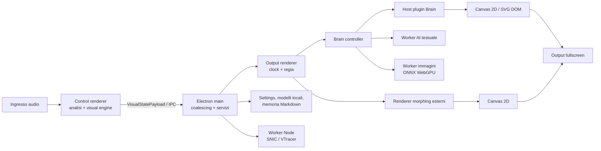

# Brain + Visual Reactive Screen — architettura corrente

Stato analizzato: 16 agosto 2026. Questo documento descrive il codice presente nel repository; non propone una nuova architettura.

## 1. Sintesi

Visual Reactive Screen è un'app desktop Electron con due finestre React separate:

- **Control** acquisisce l'audio, calcola bande e flash, mantiene le impostazioni e invia uno snapshot visuale a ogni ciclo;
- **Output** riceve gli snapshot, mantiene un clock ritmico unico e mostra a schermo intero Brain oppure uno dei renderer morphing esterni.

**Brain non è un servizio né un processo autonomo.** È un controller eseguito nel renderer Electron di Output. Genera storie e immagini, sceglie il renderer Brain attivo e pilota direttamente controller grafici DOM/Canvas/SVG. Il confine più netto disponibile è il contratto plugin interno a Brain; non esiste invece un motore grafico indipendente al quale Brain invii una scena serializzata.

La grafica finale usa soprattutto **Canvas 2D**, **SVG DOM** e compositing CSS. WebGPU è usato da ONNX Runtime per l'inferenza delle immagini, non come API di rendering dello schermo. Non esistono render graph, framebuffer astratti, compute shader o shader applicativi.

## 2. Architettura generale



### Componenti e responsabilità

| Componente | Responsabilità reale | Confine principale |
| --- | --- | --- |
| Electron main | lifecycle, finestre, display, permessi microfono, persistenza, relay IPC, archivio della coscienza, protocollo modelli e ponte verso il worker vettoriale | non esegue rendering o vettorializzazione pesante |
| Preload | espone `fxControl` o `fxOutput` tramite `contextBridge` | API IPC tipizzata, diversa per ruolo finestra |
| Control renderer | UI, acquisizione/analisi audio, stato impostazioni, flash/colore, rotazioni configurate | produce `VisualStatePayload`; non disegna l'output fullscreen |
| Output renderer | ricezione stato, clock ritmico, scelta Brain/morphing, transizioni e compositing DOM | contiene sia la regia sia i controller visuali |
| Brain | generazione narrativa e immagini, timeline della storia, coscienza, selezione dei plugin Brain | vive dentro Output e chiama direttamente il renderer host |
| Plugin Brain | trasformano raster, scena, palette e ritmo in un elemento Canvas/SVG aggiornabile | contratto comune `BrainRendererPlugin` / `BrainSceneRendererController` |
| Morphing esterni | Liquid, Oniric, PsyHyp e 2001; ciascuno crea il proprio Canvas 2D | factory locale in `OutputApp`, non usa il registry di Brain |
| Servizi esterni | download/cache dei modelli tramite librerie Hugging Face e URL configurati | nessun backend applicativo o API remota di dominio nel repository |

Il main process e i due renderer Electron sono processi separati. L'AI testuale
e l'inferenza immagini usano due Dedicated Worker distinti avviati da Output.
Il worker immagini separa ONNX e denoising dal thread JavaScript che esegue il
RAF; non costituisce però un servizio o un processo Electron autonomo e
condivide ancora le risorse GPU gestite da Chromium.

## 3. Flusso runtime

### Audio fino al frame

1. `useAudioAnalyzer` apre il dispositivo con `getUserMedia`, crea `AudioContext` e `AnalyserNode` e legge `getByteFrequencyData` nel `requestAnimationFrame` di Control.
2. I bin FFT diventano quattro energie normalizzate: `low`, `lowMid`, `mid`, `high`. Nello stesso ciclo vengono aggiornate le medie mobili.
3. `stepVisualEngine` calcola colore di fondo, luminosità e stato del flash usando energie, transienti, soglie, cooldown e impostazioni.
4. Control invia un `VisualStatePayload` attraverso il preload. Il payload contiene anche l'intero `AppSettings`, timestamp e numero di sequenza.
5. Il main conserva l'ultimo snapshot. Il coalescer mantiene al massimo uno stato in volo e l'ultimo pending; un ACK di Output sblocca il successivo. Gli stati intermedi possono quindi essere sostituiti intenzionalmente, senza creare una coda crescente.
6. Output invia l'ACK appena riceve il pacchetto e alimenta il clock ritmico prima del proprio frame pacing.
7. Il RAF di Output proietta lo stato ritmico corrente e aggiorna le crossfade. Il controller attivo riceve l'ultimo payload.
8. Brain oppure il renderer morphing disegna nel proprio Canvas/SVG; il browser compone i layer DOM con fondo, opacità, filtri e blend mode e presenta la finestra fullscreen.

### Cicli e operazioni per frame

- **RAF Control:** lettura FFT, aggregazione bande, medie mobili, visual engine e invio IPC.
- **RAF Output:** proiezione del clock ritmico e avanzamento delle transizioni tra controller.
- **RAF Brain:** timeline della storia, gestione silenzio, moto di coscienza, crossfade tra scene e `update` dei plugin corrente/uscente.
- **RAF dei morphing esterni:** Liquid, Oniric, PsyHyp e 2001 hanno ciascuno un proprio loop Canvas, con frame cap dipendente dal renderer e da `lowPowerMode`.
- **AI testuale asincrona:** richieste serializzate in una coda nel `BrainAiClient`, eseguite nel Web Worker con timeout.
- **Inferenza immagini asincrona:** un client leggero invia al Dedicated Worker
  prompt, seed, geometria, step e timeout già risolti; il worker serializza le
  richieste, mantiene le sessioni ONNX/WebGPU e restituisce un `Blob` PNG pronto.
- **Vettorializzazione asincrona:** il plugin Vector richiede la scena al main
  tramite IPC; il main trasferisce il raster a un Worker Node che esegue
  SNIC/VTracer senza fermare il relay degli snapshot audio.

Il silenzio rende inattivo il clock ritmico. Brain congela l'avanzamento della propria timeline compensando la durata del silenzio; i renderer mantengono l'immagine visibile ma devono evitare moto geometrico autonomo. La camera/quadro non è un oggetto mobile condiviso: la reattività è implementata localmente nei layer e nelle forme.

## 4. Brain

### Input

Brain riceve:

- lo snapshot `VisualStatePayload`: bande, medie, `audioPrimed`, flash e impostazioni;
- `BrainRhythmState` proiettato dall'unico `OutputRhythmClock`: impulso, indice e fase del beat, posizione musicale, inviluppo kick e transienti per banda;
- frasi e configurazione da `config/brainPhrases.txt` e `config/brainRendering.json`;
- eventuali suggerimenti dall'archivio della coscienza nel main process;
- risultati dei modelli testuali e del generatore immagini.

### Stato mantenuto

`brainController.ts` mantiene direttamente lo stato operativo della pipeline:

- produzione corrente e successiva, storia pending e coda;
- frame corrente, tempi di hold/transizione, riciclo durante l'attesa;
- selettore renderer, mazzi casuali e conteggio delle apparizioni;
- storico recente di frasi e storie e memo di sessione;
- stato di generazione, inferenza, retry, deadline e scheduler termico;
- istanze AI, traduttori, client del worker immagini e cache vettoriale;
- episodio, attenzione e moto della coscienza;
- controller grafici corrente e uscente.

Non c'è uno store globale separato per Brain: questo stato è prevalentemente chiuso nella funzione `createBrainController` e nei suoi collaboratori.

### Decisioni e produzione

1. Brain campiona 4–5 frasi, evita ripetizioni recenti e può usare un memo di sessione.
2. `CoscienzaOnirica` richiede al modello testuale una `DreamStory` di quattro frame, ne valida il formato e può applicare un'influenza proveniente dalla memoria.
3. `Psichedel` genera sequenzialmente quattro raster. Risolve profilo, step e
   geometria nell'Output, poi delega modello, UNet, VAE e codifica PNG al worker
   immagini. Retry, cooldown e priorità del refill restano in `Psichedel`.
4. La timeline cambia frame sul beat in modalità `story-cycle`; senza ritmo resta ferma.
5. `BrainRendererSelector` risolve il renderer:
   - `manual`: usa l'ID richiesto;
   - `rotation`: usa un mazzo casuale senza ripetere subito il renderer corrente, rispettando l'intervallo configurato;
   - `story-cycle`: costruisce per ogni storia un mazzo casuale bilanciato per numero di apparizioni e visita i renderer lungo quella storia.
6. `BrainRendererHost` crea il plugin, attende `isReady()` fino a 15 secondi, usa `print2d` come fallback e crossfada il layer entrante con quello uscente.

I plugin registrati oggi sono `print2d`, `psycho2d`, `vector-morph`, `material-morph`, `filter-psiche` e `bauhaus-morph`.

### Output e rapporto con il renderer

Brain non produce un DTO di scena destinato a un engine indipendente. Produce raster e oggetti `PsychedelScene`, poi costruisce e aggiorna direttamente un `BrainSceneRendererController`:

```ts
type BrainRendererPlugin = {
  id: BrainRendererId
  create(context: BrainRendererPluginContext): BrainSceneRendererController
}

type BrainSceneRendererController = {
  element: HTMLElement | SVGSVGElement
  setOpacity(opacity: number): void
  setTransition(progress: number, role: 'enter' | 'exit', shapes?): void
  update(bands, settings, time, rhythm?, movingAverages?, flash?): void
  destroy(): void
  // readiness, failure, morph shapes e resource pressure omessi qui per brevità
}
```

Esiste quindi un livello intermedio, ma è **interno e legato al DOM/Canvas/SVG**, non neutrale rispetto al backend grafico.

### Coscienza e persistenza

Il nucleo `coscienzaCore.ts` separa percezione, attenzione e interpretazione provvisoria. Il main serializza salvataggi e aggiornamenti in una coda Promise e scrive atomicamente file Markdown in `.coscienza/` durante lo sviluppo o in `<Documenti>/.coscienza/` nell'app installata. Questa memoria è separata dal JSON delle impostazioni.

## 5. Preset e impostazioni

### Modelli reali

Non esiste un'unica entità “Preset”. Il codice usa quattro famiglie indipendenti:

1. **Preset UI audio/colore**, locali a `PresetsSelector.tsx`:

   ```ts
   interface Preset {
     id?: string
     name: string
     settings: Partial<AppSettings>
   }
   ```

   L'attivazione esegue uno shallow merge della patch nel corrente `AppSettings`.

2. **Liquid/Oniric**, definiti come `MorphingPreset` in `src/shared/types.ts` e catalogati in `morphingPresets.ts`. Contengono geometria, blur, opacità, velocità, deformazione, scala, `GlobalCompositeOperation` e quantità di mapping per bande/flash.

3. **PsyHyp**, con schema proprio `{ id, name, shapes: PsyHypShapeDefinition[] }` in `psyHypMorphingShapes.ts`.

4. **2001**, con `SlitScanPreset`: moltiplicatori di linee, alpha, luminosità, glow, spessore e profondità, più orientamento ed eventuale risposta EQ.

La selezione del renderer Brain (`brainRendererId` e `brainRendererMode`) è una normale impostazione, non un oggetto preset.

### Caricamento, modifica e persistenza

`AppSettings` è il modello condiviso che contiene audio, colori, display/input selezionati, modalità Brain, algoritmo/preset morphing e controlli visuali. I default sono in `src/shared/defaults.ts`.

- I cataloghi preset sono array TypeScript compilati nell'app; non vengono caricati da file esterni.
- La UI modifica `AppSettings` tramite patch; i controller ricevono il nuovo snapshot nel payload successivo.
- `useSettingsPersistence` carica le impostazioni una volta e salva con debounce di 350 ms.
- Il main normalizza valori e ID e persiste `MEvrs-Origine-FX-settings.json` in Electron `userData`.
- Vengono persistiti impostazioni e ID selezionati, **non** definizioni di preset personalizzabili.
- Import/export, versionamento e modifica persistente del catalogo preset non sono implementati.

### Transizioni

Output calcola una chiave `famiglia:preset`, rimanda il cambio alla finestra ritmica utile e crossfada due controller. Le durate standard sono 4,5–7,5 secondi; 2001 usa stati dedicati `enter2001`, `exit2001` e `internal2001`. Brain gestisce separatamente una crossfade plugin di 1,8 secondi e le transizioni tra frame/storie.

L'opzione `alternateBrainWithMorphing` è regia di Output: dopo una storia Brain parcheggia il controller e avvia un candidato dal mazzo Liquid/Oniric/PsyHyp/2001; non introduce un nuovo tipo di preset.

## 6. Pipeline di rendering

### Tecnologie

- React rende le shell UI e i contenitori, non la grafica ad alto aggiornamento.
- Canvas 2D è usato da Liquid, Oniric, PsyHyp, 2001 e dalla maggior parte dei plugin Brain.
- SVG DOM è usato dal renderer Brain base e dalle scene vettoriali.
- Compositing: `globalCompositeOperation`, `mix-blend-mode`, opacità, filtri/blur CSS e sovrapposizione di elementi assoluti.
- `OffscreenCanvas` è usato per preprocessing raster/tensori e preparazione della vettorializzazione; PsyHyp mantiene anche un Canvas di feedback/trail.

### Sequenza effettiva dei layer

Non esiste un render graph formalizzato. La sequenza osservabile è una composizione DOM semplice:

```text
Output root
  ├─ visualSurface: colore/luminosità/flash di fondo
  ├─ layer visuale attivo
  │    ├─ Brain root → host → plugin corrente (+ plugin uscente durante crossfade)
  │    └─ oppure morphing corrente (+ morphing uscente durante crossfade)
  └─ overlay di stato/debug presenti nel componente Output
```

Le texture dei renderer sono perlopiù immagini raster e Canvas già preparati; non c'è un texture manager comune. Non esistono framebuffer/render target applicativi né compute shader. Non sono presenti Three.js, PixiJS o un altro engine grafico.

ONNX Runtime Web usa WebGPU per text encoder, UNet e VAE decoder del generatore immagini. Questo lavoro produce i raster di Brain ma non costituisce la pipeline di presentazione del frame.

## 7. Audio reactive

### Acquisizione e feature

- API: Web Media Capture + Web Audio (`getUserMedia`, `AudioContext`, `AnalyserNode`).
- Vincoli input: echo cancellation, noise suppression e automatic gain control disabilitati.
- FFT: `fftSize` configurabile da 256 a 8192; default 1024.
- Bande in `frequencyBands.ts`:
  - `low`: 40–160 Hz;
  - `lowMid`: 160–400 Hz;
  - `mid`: 400–2000 Hz;
  - `high`: 2000–8000 Hz.
- Energia: media dei bin della banda divisa per 255.
- Smoothing: medie musicali con costante temporale di 280 ms e meter con 55 ms; `audioPrimed` diventa vero dopo oltre 20 frame validi.

### Mapping

`visualEngine.ts` usa le bande per soglie, colore, intensità e trigger flash. Il trigger può leggere una banda di frequenze personalizzata, calcola il transiente rispetto alla media e applica inibizione per dominanza low, cooldown e limite di flash al secondo.

`OutputRhythmClock` deriva e mantiene un riferimento condiviso. I renderer ricevono:

- `beatPulse` per densità, contrasto o ampiezza locale;
- `beatPhase` e `musicalPosition` per micro-movimenti riallineati;
- `kickEnvelope` per attacchi low;
- transienti distinti `low`, `lowMid`, `mid`, `high`.

Il mapping concreto resta implementato dentro ogni renderer/preset. Non esiste una tabella di binding audio→parametro comune a tutti i motori.

## 8. Struttura del codice

```text
src/main/
  main.ts                         entry Electron, permessi e switch Chromium
  windows.ts                      Control/Output BrowserWindow e ultimo stato
  ipc.ts                          handler e relay IPC/coalescing
  settings.ts                     load/save/normalizzazione AppSettings
  brainVectorizer.ts              nucleo sincrono SNIC/VTracer usato dal worker
  brainVectorizerClient.ts        coda main verso Worker Node
  brainVectorizerWorker.ts        esecuzione SNIC/VTracer fuori dal main
  consciousnessArchive.ts        archivio Markdown della coscienza
  brainModelProtocol.ts           protocollo brain-model://

src/preload/
  preload.ts                      window.fxControl / window.fxOutput

src/renderer/control/
  main.tsx                        entry React Control
  ControlApp.tsx                  UI, loop audio e invio VisualStatePayload
  hooks/useAudioAnalyzer.ts       MediaDevices, Web Audio e bande
  components/PresetsSelector.tsx  preset audio/colore locali
  components/VisualControls.tsx   selezione renderer e morphing

src/renderer/output/
  main.tsx                        entry React Output
  OutputApp.tsx                   clock, regia, factory e transizioni
  visualSurface.ts                fondo colore/flash
  morphingCanvas.ts               Liquid
  oniricMorphingCanvas.ts         Oniric
  psyHypMorphingCanvas.ts         PsyHyp
  slitScanCanvas.ts               2001
  brain/
    brainController.ts            pipeline e timeline Brain
    CoscienzaOnirica.ts           generazione/validazione della storia
    Psichedel.ts                  orchestrazione immagini
    brainAiClient.ts              coda verso Web Worker
    brainAiWorker.ts              inferenza testuale/translation
    brainImageWorkerClient.ts     ponte Output verso worker immagini
    brainImageWorker.ts           coda e inferenza immagini fuori dal RAF
    brainImageWorkerProtocol.ts   messaggi tipizzati e raster pronti
    sd15OnnxWebGpu.ts             inferenza immagini ONNX WebGPU
    brainRendererPlugin.ts        contratto plugin/registry
    brainRendererRegistry.ts      sei plugin registrati
    brainRendererHost.ts          lifecycle, fallback, crossfade, passthrough
    brainRendererSelector.ts      manual/rotation/story-cycle
    brain*Canvas.ts               implementazioni Canvas dei plugin
    brainSvgScene.ts              controller SVG e contratto controller
    brainRhythm.ts                clock ritmico Output
    brainPerformanceMetrics.ts    telemetria aggregata

src/shared/
  types.ts                        contratti IPC, AppSettings e tipi comuni
  defaults.ts                     impostazioni iniziali
  visualEngine.ts                 flash/colore puro
  audioMath.ts, frequencyBands.ts calcolo audio
  morphingPresets.ts              preset Liquid/Oniric
  psyHypMorphingShapes.ts         preset PsyHyp
  slitScanPresets.ts              preset 2001
  brain/                          tipi/config condivisi di Brain

config/
  brainPhrases.txt                materiale testuale di ingresso
  brainRendering.json             qualità, timing e vettorializzazione

.coscienza/                       memoria autobiografica Markdown in sviluppo
```

## 9. Dipendenze tecniche significative

Versioni risolte nel workspace:

| Dipendenza | Versione | Ruolo |
| --- | ---: | --- |
| Electron | 33.4.11 | runtime desktop, processi, finestre, IPC |
| React / React DOM | 18.3.1 | UI Control e shell Output |
| TypeScript | 5.9.3 | linguaggio e tipi condivisi |
| Vite | 6.4.2 | build dei renderer |
| `@huggingface/transformers` | 4.2.0 | AI testuale e traduzione nel worker |
| `onnxruntime-web` | 1.24.1 | inferenza ONNX WebGPU delle immagini |
| `@visioncortex/vtracer` | 1.0.0-alpha.1 | fallback di vettorializzazione |
| `web-txt2img` | 0.3.1 | dipendenza image generation presente nel progetto |

Modelli configurati: Qwen2.5 0.5B ONNX per storia/memo/visuale, Opus MT per traduzioni e un modello SD 1.5 ONNX FP16 esplicito per le immagini. I file possono arrivare dalla cache/risorse configurate; l'app installata espone i modelli locali tramite `brain-model://`. Non risultano API HTTP applicative, WebSocket, MIDI, OSC o un servizio AI backend propri del progetto.

`@xenova/transformers` 2.17.2 è dichiarato nelle dipendenze, ma non risulta importato dal codice analizzato; per questo non è considerato parte attiva dell'architettura corrente.

## 10. Performance e osservabilità

### Target/cap nel codice

| Area | Normale | Low power / pressione |
| --- | ---: | ---: |
| Liquid | 40 fps | 30 fps |
| Oniric | 40 fps | 30 fps |
| PsyHyp | fino a 60 fps | 30 fps; 24 fps in qualità ridotta |
| Brain SVG | 60 fps, 50 sotto carico | 30 fps |
| Print2D / Psycho2D | 24 fps | 20 / 18 fps |
| FilterPsiche | 24 fps | 20 / 12 fps |
| Material Morph | 20 fps | 15 / 12 fps |
| Bauhaus Morph | 24 fps | 15 / 5 fps |
| Passthrough durante denoising | 20 fps | 15 fps |

Il RAF di Output segue il refresh del browser/display e non ha un target applicativo esplicito. Oniric e 2001 applicano propri budget interni; un unico FPS nominale per tutto il sistema non è definito.

L'opzione `reducedFpsMode` riduce soltanto il frame pacing dei renderer: usa
30 FPS per i morphing esterni e le cadenze ridotte specifiche dei plugin Brain,
senza cambiare layer, DPR, risoluzione o budget delle primitive. Rimane distinta
da `lowPowerMode`, che riduce anche complessità e qualità visuale.

### Misure già registrate nel progetto

`brainPerformanceMetrics.ts` emette ogni 10 secondi percentili p50/p95/max di gap RAF, FPS Canvas, costo render, preparazione artwork, pacchetti e latenza IPC, oltre ai rapporti di generazione/inferenza e al passthrough.

Le sessioni di prova conservate in `working/` riportano:

- Output stabile intorno a 120 Hz fuori dall'inferenza in una prova specifica;
- con UNet attivo, RAF p95 fino a 99,5 ms e massimo 558,4 ms;
- singole chiamate UNet con gap ricorrenti di circa 250–525 ms;
- passthrough 320×180 nell'ordine di 0,1–0,2 ms, quindi non responsabile dei blocchi principali;
- una baseline precedente con gap massimo RAF di 3,57 s.

Sono osservazioni di sessioni specifiche, non benchmark portabili a ogni macchina.

### Colli di bottiglia noti

- `InferenceSession.run()` dell'UNet è isolato dal thread RAF in un Dedicated
  Worker. La contesa WebGPU/GPU process può comunque produrre gap: l'effetto
  reale dell'isolamento deve essere misurato in una prova live comparabile.
- Creazione/residenza di text encoder, UNet e VAE e circa 2,02 GiB di artefatti modello hanno costo rilevante; il codice prova a riusare le sessioni, tranne in low power.
- La preparazione iniziale dei buffer Canvas e la vettorializzazione sono
  costose rispetto al compositing; SNIC/VTracer è eseguito in un Worker Node e
  il risultato resta in cache.
- Molteplici RAF indipendenti richiedono coordinamento tramite l'ultimo stato condiviso e il clock, non tramite un unico render loop.

Il frame time GPU isolato non viene misurato ed è **non determinabile dall'implementazione analizzata**. Anche temperatura reale, consumo energetico e memoria GPU effettiva sono **non determinabili dall'implementazione analizzata**: lo scheduler usa gap dei frame e modalità configurate come proxy.

## 11. Punti di accoppiamento

### Brain ↔ renderer

- `brainController.ts` crea registry, host e controller e ne chiama direttamente `update`, `setTransition`, `setOpacity` e `destroy`.
- Il contratto plugin limita la conoscenza delle singole implementazioni, ma espone `HTMLElement`, `SVGSVGElement`, `Blob`, `PsychedelScene` e forme di morphing: non è indipendente dal browser né dal modello grafico corrente.
- Vector Morph dipende dall'IPC, dal client nel main e dal Worker Node
  vettoriale; non è autosufficiente nel renderer.

### UI ↔ Brain

- La UI conosce direttamente gli ID e le modalità dei renderer Brain tramite `AppSettings` e `VisualControls`.
- Il normalizzatore del main conosce la mutua esclusione `useBrain`/`useMorphing`, la modalità `story-cycle` e l'alternanza 80/20.
- Aggiungere un nuovo ID Brain richiede almeno aggiornare tipi condivisi, default/normalizzazione, UI e registry.

### Preset ↔ grafica

- `MorphingPreset.blendMode` è un `GlobalCompositeOperation`, quindi il modello Liquid/Oniric è direttamente legato a Canvas 2D.
- PsyHyp e 2001 hanno schemi specifici consumati direttamente dai rispettivi renderer.
- La factory di Output contiene rami espliciti per ogni algoritmo morphing e conosce le transizioni speciali di 2001.

### Stato condiviso

- `VisualStatePayload` trasporta l'intero `AppSettings` a ogni aggiornamento: Control, main e Output condividono un contratto ampio.
- Output mantiene `latestInputState`, `latestRenderedState`, controller attivo/transizione e un singolo clock ritmico locale alla finestra.
- I renderer mantengono internamente smoothing e buffer propri; non condividono uno store grafico globale.

### Impatto della sostituzione del renderer

- **Sostituire un solo plugin Brain:** è possibile conservando `BrainRendererPlugin` e `BrainSceneRendererController`; possono servire aggiornamenti a ID, UI e normalizzazione se il plugin è aggiuntivo.
- **Integrare un nuovo morphing esterno:** richiede modifiche alla union `MorphingAlgorithm`, alla UI/preset, alla normalizzazione e alla factory/transizioni di `OutputApp`.
- **Sostituire Canvas/SVG con un altro engine:** audio, Control e gran parte dell'IPC possono restare perché inviano valori scalari. Devono invece essere adattati Output, host/controller Brain, gestione DOM delle crossfade e preset che espongono tipi Canvas.
- **Introdurre un render graph:** oggi non c'è un punto unico da rimpiazzare. Il candidato naturale è la regia di layer/transizioni in `OutputApp` più il contratto controller, mantenendo inizialmente i renderer esistenti come nodi/adattatori. Questa è una possibilità dedotta dalla struttura, non una componente già implementata.

## 12. Valutazione compatta

- La separazione tra acquisizione audio e output è buona e passa attraverso tipi IPC condivisi.
- Brain ha una separazione parziale dai suoi renderer grazie al registry/host, ma resta accoppiato al DOM e al lifecycle grafico.
- I morphing esterni non condividono il plugin system di Brain e sono orchestrati con rami espliciti.
- Il sistema preset è funzionale ma frammentato in cataloghi e schemi differenti; non esiste ancora un resolver o lifecycle comune.
- La principale criticità prestazionale misurata è l'inferenza UNet nel renderer Output, non il costo del passthrough o del compositing di base.
- Un'astrazione futura può essere introdotta attorno ai controller e alla regia Output senza cambiare subito audio e IPC; il codice attuale non giustifica però un render graph completo finché i pass restano semplici layer Canvas/SVG.
