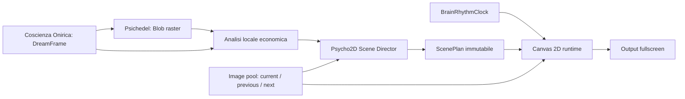

# Piano di Lavoro: Psycho2D — Regia Semantica A Finestre

> **ID Piano**: `PIANO-009`  
> **Macrotask di Riferimento**: `MACRO-010`  
> **Data Creazione**: 2026-08-09  
> **Stato**: `IN_PROGRESS — V1 IMPLEMENTATA, VALIDAZIONE LIVE PENDING`  
> **Autore/Agente**: Codex

---

## 1. Comprensione Del Problema

`psycho2d` deve trasformare un flusso lento e discontinuo di immagini AI in un
flusso visuale continuo, variabile e musicalmente credibile. Il valore non deve
venire dalla generazione di altri frame, ma dalla regia di pochi asset raster:
crop, finestre, maschere, ricomposizione e takeover progressivi.

Il problema ha tre tempi diversi:

1. la generazione produce quattro immagini in circa 90–105 secondi;
2. il renderer deve restare vivo a ogni frame anche durante inferenza e cooldown;
3. una configurazione visuale deve cambiare abbastanza spesso da non far
   percepire ogni immagine come una lunga animazione ripetuta.

Il principio architetturale è quindi corretto e va mantenuto netto:

- l'analisi produce fatti o ipotesi sull'immagine, con provenienza e confidenza;
- il `Psycho2D Scene Director` produce un piano di regia discreto e limitato;
- il renderer Canvas 2D esegue quel piano in tempo reale usando audio, beat e
  transizioni, senza chiamare AI nel ciclo grafico.

Il risultato minimo credibile non richiede segmentazione, depth estimation o
riconoscimento universale degli oggetti. Richiede soprattutto di sapere dove
non coprire, dove un overlay è leggibile e quale dettaglio vale la pena
ingrandire.

---

## 2. Architettura Esistente Rilevante

### Pipeline già disponibile

- `coscienzaOnirica.ts` costruisce una storia di quattro `DreamFrame`. Ogni
  frame contiene già `description`, `visualIntent`, `imagePrompt`, `energy` e
  `durationMs`: è contesto semantico gratuito, ma non prova la geometria
  dell'immagine generata.
- `psichedel.ts` genera una `Blob` raster per frame, la conserva dentro
  `PsychedelScene.raster` e notifica progressivamente ogni scena pronta.
- `brainController.ts` mantiene `currentProduction`, `nextProduction`, indice
  corrente, riciclo dei quattro frame, ritmo, transizioni e pressione dovuta
  all'inferenza.
- `BrainRhythmClock` espone fase del beat, impulso, durata, posizione musicale e
  transienti distinti per `low`, `lowMid`, `mid`, `high`.
- `brainImageBuffer.ts` formalizza buffer completo, finestra di refill e
  comportamento durante il cooldown.
- `brainRenderingConfig.ts` offre configurazione caricabile e normalizzata
  senza obbligare subito a estendere le impostazioni utente globali.
- `OutputApp.tsx` crea un solo controller Brain, lo aggiorna con i pacchetti
  audio coalescenti e ne garantisce il cleanup.

### Renderer Brain corrente

`brainPsycho2dCanvas.ts` esiste già, ma implementa un altro concetto:
quantizzazione in sei livelli, frammenti di inchiostro e sette linguaggi
serigrafici (`living-ink`, `riso-echo`, ecc.). Usa una sola immagine per canvas,
non possiede finestre, image pool, metadati semantici o takeover A → B.

Questo è un conflitto di nome, non una base completa del requisito. Sono però
riutilizzabili:

- setup e lifecycle del canvas;
- decodifica `Blob` → `ImageBitmap`;
- frame pacing 24/20/18 fps;
- comportamento quasi fermo in silenzio;
- mapping separato delle quattro bande;
- metriche Canvas e flag `resourcePressure`;
- trasformazioni locali e cleanup.

### Limiti osservati da rispettare

- La creazione/inferenza ONNX WebGPU avviene nello stesso renderer dell'Output
  e ha già prodotto gap RAF fino a 3,57 s. `psycho2d` non deve aggiungere una
  seconda inferenza pesante durante il live.
- Il buffer corrente resta visibile durante il refill; quello successivo viene
  promosso solo quando è completo.
- All'avvio di una nuova produzione, alcune mappe di anteprima vengono ripulite.
  Il futuro image pool deve quindi possedere esplicitamente i riferimenti che
  vuole mantenere, con un limite di memoria.
- La camera globale deve restare stabile. Il movimento va distribuito fra
  finestre e crop, mai applicato all'intero quadro.

---

## 3. Componenti Esistenti Riutilizzabili

| Esistente | Riutilizzo proposto | Modifica richiesta |
|---|---|---|
| `PsychedelScene.raster` | sorgente delle texture | nessuna in V1 |
| `DreamFrame` | hint narrativi e intensità | nessuna in V1; collegamento per ID |
| `BrainProduction` | buffer di quattro immagini | accesso tramite image pool leggero |
| `BrainRhythmClock` | beat, fase, transienti e bande | nessuna |
| `calculateBrainFrameTiming` | durata minima e cambio sul beat | generalizzazione o wrapper |
| `BrainSvgController` | lifecycle comune del controller visuale | preferibile rinominarlo in seguito |
| frame pacing Psycho2D corrente | 24 fps, 20 low power, 18 in inferenza | estrazione in helper condiviso |
| `brainPerformanceMetrics` | costo preparazione e frame Canvas | aggiungere metriche Director/cache in V2 |
| `brainRenderingConfig` | feature flag e parametri di prova | nuova sezione `psycho2d` |
| palette della storia | tint, gradient overlay e bordi | uso diretto |

Non è necessario modificare Main, preload o IPC per dimostrare V1: immagini,
audio e configurazione sono già presenti nella Output Window.

---

## 4. Proposta Architetturale Minima

La proposta minima aggiunge quattro unità locali a
`src/renderer/output/brain/`:

1. `brainPsycho2dAnalysis.ts`: analisi raster economica e deterministica;
2. `brainPsycho2dDirector.ts`: conversione dell'analisi in un `ScenePlan`;
3. `brainPsycho2dImagePool.ts`: riferimenti a CURRENT/PREVIOUS/NEXT e cache
   limitata degli `ImageBitmap` decodificati;
4. `brainPsycho2dWindowCanvas.ts`: renderer Canvas 2D della scena e delle
   finestre.

Il Director non gira a ogni frame. Viene invocato:

- quando un'immagine entra nel pool;
- quando una configurazione termina;
- quando `NEXT_IMAGE` diventa disponibile;
- al massimo su un confine musicale stabilizzato, mai per ogni transiente.

Il renderer riceve piani immutabili e interpola soltanto valori numerici.



---

## 5. Flusso Dati Completo

1. Psichedel completa una nuova `PsychedelScene` e fornisce la `Blob` raster.
2. L'image pool registra il riferimento senza copiare i byte.
3. Un `ImageBitmap` ridotto, per esempio 160×90 o 240×135, viene usato una sola
   volta per l'analisi; il bitmap di rendering viene decodificato solo quando
   l'immagine è attiva.
4. L'analisi locale calcola palette, contrasto, salienza, densità, orientamento
   dei bordi, zone protette e zone adatte agli overlay.
5. Gli hint narrativi vengono allegati con provenienza `narrative`; non possono
   creare bounding box che i pixel non confermano.
6. Il Director sceglie un template di regia compatibile con le capacità
   effettive e produce un `ScenePlan` deterministico a partire da un seed.
7. Il canvas disegna il fondo, applica clip e `drawImage()` per ogni finestra,
   poi applica tint/bordo/overlay economici.
8. L'audio modula parametri locali entro clamp stretti. Il beat può sbloccare
   un cambio di fase dopo una durata minima.
9. Quando una finestra `NEXT_IMAGE` completa il takeover, il pool promuove B a
   CURRENT, A a PREVIOUS e il Director prepara un nuovo piano.
10. Durante cooldown o errore di generazione, il Director continua a produrre
    nuove configurazioni usando le immagini già validate.

---

## 6. Responsabilità Del Psycho2D Scene Director

Il Director deve decidere poco, in modo verificabile:

- template della configurazione: dettaglio, dialogo fra due immagini,
  attraversamento, portale o takeover;
- numero di finestre: V1 massimo due, `lowPowerMode` massimo una;
- contenuto di ogni finestra;
- crop normalizzato e rettangoli iniziale/finale;
- forma fra un vocabolario chiuso;
- area protetta da non coprire;
- ingresso, uscita e possibilità di takeover;
- durata minima, finestra di sincronizzazione al beat e ordine dei layer;
- trasformazioni cromatiche entro budget;
- fallback se il contenuto richiesto non è disponibile.

Non deve:

- eseguire animazione frame-by-frame;
- reinterpretare continuamente l'immagine;
- inventare volti, porte o profondità non osservati;
- controllare direttamente GPU, DOM o audio analyzer;
- produrre traiettorie casuali senza vincoli compositivi.

La varietà viene da pochi template combinati con contenuti e crop diversi, non
da casualità continua. A parità di immagini e seed, il piano deve essere
riproducibile e testabile.

---

## 7. Struttura Minima Dei Metadati

Il modello dati V1 deve usare coordinate normalizzate 0–1 e distinguere
osservazione da interpretazione.

```ts
type Psycho2DSource = 'pixels' | 'narrative' | 'fallback'

type Psycho2DRegion = {
  x: number
  y: number
  width: number
  height: number
  score: number
  source: Psycho2DSource
}

type Psycho2DImageAnalysis = {
  version: 1
  imageId: string
  aspectRatio: number
  focalRegion: Psycho2DRegion
  protectedRegions: Psycho2DRegion[]
  overlayRegions: Psycho2DRegion[]
  detailCrops: Psycho2DRegion[]
  dominantAxis: 'horizontal' | 'vertical' | 'diagonal' | 'neutral'
  dominantDirection: 'left-to-right' | 'right-to-left' | 'up' | 'down' | 'none'
  palette: string[]
  luminance: number
  contrast: number
  narrativeHints: string[]
}

type Psycho2DContentKind =
  | 'CURRENT_IMAGE'
  | 'CURRENT_DETAIL'
  | 'PREVIOUS_IMAGE'
  | 'NEXT_IMAGE'
  | 'NEXT_IMAGE_DETAIL'
  | 'PROCEDURAL'

type Psycho2DWindowPlan = {
  id: string
  content: Psycho2DContentKind
  sourceImageId?: string
  crop: Psycho2DRegion
  from: Psycho2DRegion
  to: Psycho2DRegion
  shape: 'rect' | 'rounded-rect' | 'ellipse'
  enter: 'reveal' | 'slide' | 'grow'
  exit: 'fade' | 'slide' | 'takeover'
  color: { hue: number; saturation: number; brightness: number; contrast: number; tint?: string }
}

type Psycho2DScenePlan = {
  id: string
  seed: number
  baseImageId: string
  durationMs: number
  transitionOnBeat: boolean
  windows: Psycho2DWindowPlan[]
  takeoverWindowId?: string
}
```

Per V1 non servono tassonomie di oggetti, maschere arbitrarie, depth map o
keyframe generici. `portalCandidates`, `faces` e `objects` possono essere
aggiunti in V2 soltanto se un analizzatore reale li produce.

---

## 8. Primitive Grafiche Necessarie

V1 richiede soltanto:

- `drawImage()` con source crop e destination rect;
- `save()`, `clip()`, `restore()`;
- path rettangolare, rounded rectangle ed ellisse;
- translate/scale con camera globale ferma;
- alpha e due o tre blend mode già supportati da Canvas 2D;
- `context.filter` per hue/saturation/brightness/contrast, con fallback a tint;
- gradient overlay lineare o radiale;
- bordo/ombra leggeri;
- easing `smootherstep` e interpolazione di rettangoli.

Il minor insieme per A → B è ancora più piccolo: un'immagine base, un solo
rettangolo di clip e un `drawImage()` di B che cresce fino ai bounds del canvas.

---

## 9. Gestione CURRENT / PREVIOUS / NEXT

L'image pool deve separare disponibilità logica e decodifica GPU/Canvas:

- `CURRENT_IMAGE`: immagine di base attuale;
- `CURRENT_DETAIL`: stessa sorgente, crop scelto fra `detailCrops`;
- `PREVIOUS_IMAGE`: ultimo CURRENT promosso o un altro frame già visto;
- `NEXT_IMAGE`: immagine pronta candidata al takeover;
- `NEXT_IMAGE_DETAIL`: crop della candidata successiva;
- `PROCEDURAL`: solo fallback economico, per esempio gradient/palette/noise
  statico; nessun nuovo motore generativo.

Budget consigliato V1:

- riferimenti Blob: quattro immagini della produzione corrente più al massimo
  una precedente e una successiva;
- bitmap decodificati: base + massimo due sorgenti visibili;
- al cambio, chiudere (`ImageBitmap.close`) ciò che non è più raggiungibile;
- niente duplicazione della Blob per crop diversi;
- in `lowPowerMode`, base + una sola finestra e massimo due bitmap attivi.

La prima V1 può interpretare PREVIOUS come precedente frame della stessa
produzione. La conservazione cross-story va abilitata solo con un budget
misurato, perché l'esperimento `MACRO-009` sta già valutando memoria e sessioni
modello residenti.

---

## 10. Funzionamento Delle Finestre Mobili

Ogni finestra è un attore con geometria iniziale e finale, crop, contenuto e
stato. Il renderer interpola la geometria lungo fasi discrete:

1. `enter`: reveal, slide o grow;
2. `hold`: movimento quasi nullo, sola respirazione locale legata all'audio;
3. `travel`: spostamento controllato lungo asse/direzione della composizione;
4. `exit` oppure `takeover`.

Regole compositive V1:

- una finestra non deve intersecare una regione protetta oltre una soglia;
- i dettagli partono vicino alla regione focale ma arrivano in una zona overlay;
- una finestra NEXT entra preferibilmente da un lato coerente con l'asse
  dominante;
- massimo due traiettorie attive e fasi sfalsate;
- niente moto browniano o drift autonomo continuo;
- in silenzio si completa solo la fase già iniziata e poi la scena si assesta.

---

## 11. Strategia Di Transizione A → B

Template minimo `portal-takeover`:

1. A viene disegnata fullscreen e resta stabile.
2. Una finestra mostra B con un crop cover coerente con il suo punto focale.
3. La finestra entra in una `overlayRegion` di A o usa un portale riconosciuto
   in versioni successive.
4. Dopo hold minimo, la finestra cresce con `smootherstep` fino al fullscreen.
5. Durante l'ultimo 20% il crop converge dal dettaglio alla composizione cover
   completa di B; A può scendere di opacità senza muoversi.
6. B viene promossa atomicamente a CURRENT.
7. Il canvas ridisegna B come base, elimina la clip e prepara il piano seguente.

Non servono due canvas né una gerarchia DOM per finestra. Un canvas, due
`drawImage()` e una clip sono sufficienti. Il commit atomico evita un salto fra
l'ultimo frame della finestra e il primo frame fullscreen.

Se B non è disponibile, lo stesso template usa `CURRENT_DETAIL` e termina con
un'uscita, non con un takeover.

---

## 12. Reattività Audio Possibile

Mapping V1 consigliato, già coerente con il progetto:

| Segnale | Parametro locale | Limite |
|---|---|---|
| `low` | micro-scala della finestra e profondità bordo | circa ±3%, mai quadro globale |
| `lowMid` | avanzamento/ampiezza laterale della traiettoria | envelope smussato |
| `mid` | apertura della maschera o offset del crop | pochi pixel/percentuali |
| `high` | contrasto/tint/bordo/glint | rate limit e alpha basso |
| beat | cambio fase o scelta del prossimo piano | solo dopo durata minima |
| `motionProfile` | gain e release | ambient più lento, techno più netto, dub elastico |

L'audio non deve decidere la semantica. Modula un piano già valido. Nessuna
finestra deve inseguire ogni transiente e nessuna pulsazione va applicata alla
camera globale.

---

## 13. Valutazione SVG

### Cosa si guadagnerebbe

- maschere arbitrarie e portali aderenti a contorni complessi;
- bordi e cornici scalabili;
- riuso dell'attuale pipeline di vettorializzazione per estetiche ibride.

### Costo

- un secondo modello di scena accanto al canvas;
- serializzazione e gestione di path/clipPath;
- maggiore difficoltà di morph e cleanup;
- la vettorializzazione esistente estrae contorni grafici, non semantica: non
  dice che un contorno sia un volto, una porta o uno specchio;
- costo di preprocessing non giustificato dal proof of concept.

### Decisione raccomandata

No SVG in V1. Rettangoli arrotondati, ellissi, gradienti e bordi Canvas coprono
interamente il concept minimo. Valutare SVG in V3 per portali a contorno libero
solo dopo che la regia rettangolare ha dimostrato valore artistico.

L'immagine AI non va convertita integralmente in SVG.

---

## 14. Buffer E Cooldown

Il Director non assegna a ogni immagine una durata fissa di 50 secondi. Produce
una sequenza di configurazioni da circa 8–18 secondi, sincronizzabili a frasi
musicali:

- dettaglio corrente;
- finestra con un altro frame del buffer;
- dialogo current/previous;
- attraversamento senza takeover;
- takeover verso un frame già disponibile;
- takeover verso NEXT appena pronto.

Con quattro immagini, anche limitando V1 a quattro template e due crop per
immagine, lo spazio combinatorio utile supera ampiamente il cooldown senza
dover inventare nuove categorie.

Il pool deve preferire una coda di utilizzo recente, evitando ripetizioni
immediate dello stesso `(base, content, crop, template)`. La storia successiva
non interrompe istantaneamente il piano attivo: diventa candidata e viene
introdotta al primo confine di takeover valido.

---

## 15. Failure E Fallback

| Guasto/assenza | Fallback |
|---|---|
| analisi pixel fallita | griglia dei terzi, centro protetto, crop centrale |
| nessuna zona overlay affidabile | fascia laterale con minore densità stimata |
| NEXT assente | CURRENT_DETAIL o PREVIOUS, senza takeover |
| Blob/bitmap non decodificabile | mantieni CURRENT; rimuovi sorgente dal pool |
| metadati narrativi discordanti | prevalgono i pixel; hint marcato non verificato |
| frame lungo/inferenza attiva | 18 fps, una finestra, filtri ridotti |
| `lowPowerMode` | 20 fps, una finestra, niente ombre/filter costosi |
| silenzio | scena quasi ferma, nessun moto geometrico autonomo |
| Director non produce piano valido | crossfade esistente o base fullscreen |
| NEXT arriva a metà piano | accodamento fino al prossimo confine sicuro |

Il fallback finale deve sempre essere una raster fullscreen visibile; mai uno
schermo nero e mai l'attesa bloccante di metadati AI.

---

## 16. Progressione V1 → V2 → V3

### V1 — Proof Of Concept Artistico

Implementare:

- analisi pixel locale a bassa risoluzione: salienza/densità, contrasto,
  palette, asse dominante, focal/overlay/detail regions;
- image pool dei quattro frame con CURRENT/PREVIOUS/NEXT logici;
- Director deterministico con 3–4 template e massimo due finestre;
- forme rect, rounded-rect, ellipse;
- contenuti CURRENT_IMAGE, CURRENT_DETAIL, PREVIOUS_IMAGE, NEXT_IMAGE e
  NEXT_IMAGE_DETAIL;
- PROCEDURAL solo come gradient/tint di fallback;
- takeover A → B con una clip crescente;
- mapping audio semplice e supporto `motionProfile`/`lowPowerMode`;
- feature flag in `brainRenderingConfig`, non necessariamente nella UI;
- metriche di decode/preparazione/frame e test delle funzioni pure.

Non implementare:

- vision model, face detector, object detector, segmentazione o depth map;
- SVG o maschere arbitrarie;
- editor manuale della regia;
- database, microservizi, code o worker aggiuntivi;
- DSL generica di keyframe;
- più di due finestre o fisica delle collisioni;
- memoria illimitata cross-story;
- AI nel render loop;
- controlli UI definitivi prima della validazione artistica.

File esistenti da modificare in V1:

- `src/shared/brain/brainTypes.ts`: tipi minimi opzionali, se il piano viene
  associato alla produzione;
- `src/renderer/output/brain/brainController.ts`: image pool, promozione delle
  immagini e selezione del nuovo controller;
- `src/renderer/output/brain/brainRenderingConfig.ts`: feature flag e budget;
- `src/renderer/output/brain/brainPerformanceMetrics.ts`: misure essenziali;
- eventualmente `brainPsycho2dCanvas.ts`, solo dopo la decisione sul nome.

Nuovi file V1:

- `brainPsycho2dAnalysis.ts` + test;
- `brainPsycho2dDirector.ts` + test;
- `brainPsycho2dImagePool.ts` + test;
- `brainPsycho2dWindowCanvas.ts` + test.

Verifica visuale V1:

1. usare quattro immagini reali già prodotte, senza nuova inferenza durante il
   primo test;
2. mostrare almeno sei configurazioni distinguibili in 120 secondi;
3. verificare una transizione A → B senza salto al commit fullscreen;
4. verificare che volto/focus stimato non venga coperto nei casi selezionati;
5. lasciare l'audio in silenzio: geometria quasi ferma;
6. provare dub/techno/ambient e verificare differenze senza camera globale;
7. attivare `lowPowerMode` e inferenza: continuità, cleanup e FPS coerenti;
8. misurare preparazione, frame lunghi, memoria bitmap e ripetizioni dei piani.

Criterio artistico minimo: in una prova cieca di due minuti non deve sembrare
che ciascuna immagine sia semplicemente rimasta sullo schermo con uno zoom.

### V2 — Semantica Visuale Mirata

- analizzatore visuale opzionale, eseguito una volta per immagine e mai nel RAF;
- categorie limitate realmente utili: face/eyes, aperture architettoniche,
  circular object, foreground/background approssimati;
- `portalCandidates` con confidence e provenance;
- più template compositivi, ma ancora massimo due/tre finestre;
- conservazione cross-story misurata e politica LRU;
- modalità A/B selezionabile dalla Control Window solo dopo stabilità V1;
- cache dei metadati associata all'immagine, non memoria autobiografica.

Prima scelta V2: verificare se un piccolo detector locale o un'unica analisi
multimodale produce più valore artistico del solo saliency map. Non assumere
che una pipeline completa di segmentazione sia necessaria.

### V3 — Funzioni Avanzate Validate

- maschere a contorno libero o SVG per portali reali;
- depth layers/parallax leggero solo con stima affidabile e camera stabile;
- Director capace di revisionare piani su relazioni fra immagini;
- strumenti di authoring/debug per visualizzare salienza, regioni e motivazione;
- eventuali piani suggeriti da Coscienza Onirica come metadati, sempre
  validati e normalizzati localmente;
- persistenza opzionale delle analisi per asset, con versioning e invalidazione.

---

## 17. Rischi Tecnici

1. **Collisione nominale**: il renderer attuale chiamato Psycho2D ha identità
   diversa. Sovraccaricare il nome renderebbe test e configurazione ambigui.
2. **Semantica allucinata**: il prompt descrive l'intento, non garantisce la
   posizione reale del soggetto. Provenienza e confidence sono obbligatorie.
3. **Memoria**: Blob economiche e bitmap decodificati non sono equivalenti. Il
   pool deve limitare soprattutto gli `ImageBitmap` attivi.
4. **Contesa Output/WebGPU**: analisi o decode nel momento sbagliato possono
   amplificare i freeze già osservati. Preparazione fuori dal RAF e pacing sono
   indispensabili.
5. **Ripetitività del Director**: troppi template casuali sembrano arbitrari;
   troppo pochi sembrano preset ciclici. Servono history e vincoli semantici.
6. **Crop scorretto**: una salienza semplice può scegliere texture anziché il
   soggetto. Il fallback deve evitare crop estremi e preservare il centro.
7. **Takeover discontinuo**: differenze fra crop della finestra e crop base di B
   causano un salto. Devono convergere prima del commit.
8. **Filtri Canvas**: cambi frequenti di `context.filter`, blur e ombre possono
   costare. V1 deve usare pochi stati e disattivarli sotto pressione.
9. **Debug invasivo**: overlay semantici sono utili in sviluppo ma non devono
   restare attivi nella modalità live.
10. **Interferenza con MACRO-009**: una nuova pipeline grafica falserebbe il
    confronto prestazionale in corso. Implementare solo dopo aver chiuso o
    congelato quella baseline.

---

## 18. Decisioni Necessarie Prima Dell'Implementazione

1. **Nome e destino del renderer corrente** — raccomandazione: rinominare
   l'attuale `brainPsycho2dCanvas` in un nome esplicito come
   `brainPrint2dCanvas`, conservandolo come stile o possibile contenuto
   procedurale; riservare `psycho2d` alla regia a finestre del brief.
2. **Attivazione V1** — raccomandazione: feature flag in
   `brainRenderingConfig`, senza nuova UI iniziale, per confrontare renderer
   corrente e finestre durante il live.
3. **Livello semantico V1** — raccomandazione: pixel analysis locale + hint
   narrativi con provenance; nessun vision model.
4. **Significato di PREVIOUS** — raccomandazione V1: precedente frame visto,
   anche nella stessa storia; cross-story solo dopo misura memoria.
5. **Momento di avvio** — raccomandazione: non alterare la prova
   `MACRO-009/TASK-009-05`; iniziare dopo il confronto del secondo ciclo o su
   una baseline separata.
6. **Criterio artistico di accettazione** — concordare un breve set di immagini
   e un test live di due minuti, valutando leggibilità, varietà, non copertura
   del focus e qualità del takeover.

---

## 19. Checklist Del Futuro Piano Esecutivo

### Fase 1 — Contratti E Analisi

- [x] Approvare le sei decisioni del paragrafo 18.
- [x] Introdurre registry e host dei renderer Brain con cambio live sicuro.
- [x] Esporre selezione manuale e rotazione temporizzata nella Control Window.
- [x] Risolvere il conflitto nominale senza perdere il renderer serigrafico.
- [x] Implementare e testare analisi raster minima e provenance.
- [x] Implementare e testare image pool con budget e cleanup.

### Fase 2 — Director E Renderer

- [x] Implementare Scene Director puro e deterministico.
- [x] Implementare primitive Canvas e takeover atomico.
- [x] Integrare audio, `motionProfile`, `lowPowerMode` e resource pressure.
- [x] Integrare nel controller tramite selezione persistita e plugin registry.

### Fase 3 — Validazione

- [x] Eseguire test unitari, `pnpm typecheck` e lint mirato.
- [ ] Verificare due minuti con quattro immagini senza nuova generazione.
- [ ] Verificare cooldown/refill e arrivo ritardato di NEXT.
- [ ] Confrontare frame time e memoria con la baseline corrente.
- [x] Eseguire `pnpm build` solo se l'integrazione finale coinvolge artefatti
  destinati al pacchetto Electron.

### Registro Implementazione

- **2026-08-10**: introdotti registry, selector e host dei renderer Brain;
  `Print2D` e `Psycho2D` sono plugin compilati con cambio manuale o temporizzato.
- **2026-08-10**: aggiunti analisi raster locale, Scene Director, finestre
  CURRENT/PREVIOUS/NEXT, takeover Canvas, supporto audio e low power.
- **2026-08-10**: 31 file e 214 test verdi, typecheck e lint mirato verdi;
  build Electron/macOS riuscita. Il lint globale resta fermo esclusivamente
  sul `prefer-const` preesistente in `slitScanCanvas.ts:639`.
- **2026-08-10**: smoke test Electron reale riuscito con `Print2D` durante
  generazione e riciclo. Cambio live verso `Psycho2D` ancora da verificare
  manualmente su Output fullscreen.
- **2026-08-10**: autorizzato il recupero del renderer vettoriale storico come
  terzo plugin `Vector Morph`; implementato con vettorializzazione lazy,
  deduplicazione per Blob, cache limitata e fallback non bloccante.
- **2026-08-10**: `Vector Morph` registrato insieme a `Print2D` e `Psycho2D`,
  selezionabile manualmente o dalla rotazione live. Readiness asincrona,
  timeout e cooldown impediscono loop di retry e mantengono visibile il plugin
  precedente in caso di errore.
- **2026-08-10**: suite completa aggiornata a 33 file e 218 test; typecheck,
  lint mirato, build Electron/macOS e `git diff --check` verdi.
- **2026-08-10 — revisione artistica richiesta**: eliminare bordi cromatici,
  finestre vaganti e takeover interni. Psycho2D deve mostrare una raster base
  stabile e una sola seconda raster fissa in posizione casuale per scena. Il
  movimento deve appartenere a forme cromatiche attraversanti, sincronizzate
  alle quattro bande e fuse con i pixel già miscelati secondo l'opacità del
  layer superiore. Implementazione in corso come `TASK-010-10`.
- **2026-08-10 — revisione artistica implementata**: Director ridotto a una
  sola sovrapposizione rettangolare fissa, posizione casuale deterministica per
  scena e opacità 0,38–0,64 derivata da contrasto e distanza di luminanza.
  Rimossi ingresso da fuori schermo, deriva, ridimensionamento, takeover,
  seconda finestra e bordo. Quattro famiglie cromatiche attraversano il
  composito con blend `multiply`, `soft-light`, `screen` e `overlay`, guidate
  separatamente da bande e transienti. Suite: 34 file, 227 test; typecheck,
  lint mirato, build Vite/Main/Preload e diff-check verdi.
- **2026-08-10 — raster Vector Morph resa visibile**: aggiunto il raster
  originale come fondale `object-fit: cover` al 92%; il livello vettoriale è
  sovrapposto al 70% e il suo colore di fondo è reso trasparente. Opacità
  stabili, nessun nuovo calcolo per frame e cleanup dell'Object URL. Suite: 35
  file, 228 test; typecheck, lint mirato, build Vite/Main/Preload e diff-check
  verdi.
- **2026-08-10 — nuova revisione Psycho2D richiesta**: rimuovere le quattro
  forme attraversanti, giudicate banali, e trasformare la composizione fissa a
  due immagini in una serigrafia 1-bit ad alto contrasto. Preparazione una
  tantum di tre densità; runtime limitato a selezione densità su `lowMid`,
  inversione breve su beat/`low` e micro-glitch orizzontale su `mid`/`high`.
  Implementazione avviata come `TASK-010-12`.
- **2026-08-10 — Psycho2D 1-bit implementato**: rimosse integralmente le
  primitive massa, nastro, rombo e punti. Le due raster fisse vengono fuse una
  volta rispettando l'opacità del layer superiore, campionate a 320×180 e
  convertite in tre matrici Bayer a due inchiostri. Il runtime seleziona la
  densità con `lowMid`, applica inversione di 85 ms sul beat/`low` e massimo
  tre fasce glitch su transienti `mid`/`high`. Nessun filtro pixel nel RAF.
  La stessa grammatica è riusata dal passthrough di denoising. Suite: 37 file,
  233 test; typecheck, lint mirato, build Vite/Main/Preload e diff-check verdi.
- **2026-08-10 — transizioni “Tutti per storia” curate sul beat**: il timing
  del morphing viene congelato all'istante del cambio e quantizzato a un numero
  intero di beat; in `story-cycle` il cambio è consentito solo su beat reale o
  sulla finestra di fase prossima al beat. Psycho2D ora usa scanline 1-bit
  deformate con inviluppo a campana durante `setTransition`, quindi non resta
  una semplice dissolvenza quando entra o esce dal mazzo renderer.
- **2026-08-10 — beatmatch Psycho2D stabilizzato**: il beat viene latched
  prima del controllo del frame interval e resta disponibile per il frame
  successivo; rimossa la soglia rigida `low >= 0.06`. `beatPulse` guida
  densità, contrasto e ampiezza delle scanline, mentre `beatPhase` orienta il
  micro-disallineamento. `mid` e `high` restano responsabili soltanto dei
  dettagli glitch secondari; nessuna trasformazione globale dell'immagine.
- **2026-08-10 — beatmatch Psycho2D reso più attivo**: corretto il campionamento
  delle scanline dalla matrice 1-bit 320×180 verso la canvas reale, che prima
  poteva rendere invisibili molte fasce su fullscreen. Il latch del beat sale a
  150 ms, il contrasto e l'ampiezza locale aumentano, le fasce passano a sette
  in modalità normale e i colpi `difference` restano confinati a segmenti
  locali della materia. In `lowPowerMode` e sotto pressione il budget scende a
  tre fasce.

---

## 20. Esito Dell'Analisi

Il concept è compatibile con l'architettura corrente e V1 può essere realizzata
come estensione locale della Output Window. La sofisticazione utile sta nel
Director deterministico e nei vincoli compositivi, non in una pipeline di
computer vision complessa.

La soluzione raccomandata per V1 è: analisi raster minima, massimo due finestre,
tre forme Canvas, quattro template, image pool limitato e takeover A → B con una
sola clip crescente. SVG, vision model, segmentazione e profondità restano fuori
finché il comportamento non viene validato artisticamente.

La V1 è implementata, incluso il recupero del renderer vettoriale storico come
terzo plugin. Resta la validazione artistica e prestazionale manuale dei tre
renderer sull'Output fullscreen.

### Aggiornamento 2026-08-10 — Flash globale nei pixel Psycho2D

L'intensità già calcolata dal render globale attraversa il Brain e muove
soltanto fasce locali della matrice 1-bit Psycho2D, con piccoli colpi
`difference` e budget ridotto in low power. Un test del Renderer Host verifica
che il segnale raggiunga sia il plugin attivo sia quello entrante nel crossfade.
